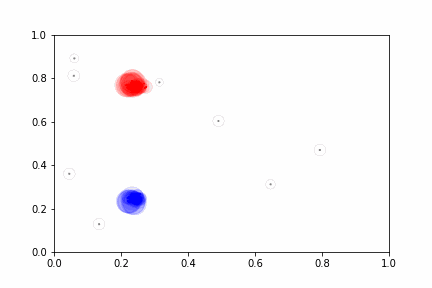

# RE-FuzzStream: Dispersion-Based Fuzzy Data Stream Clustering

Implementation of the fuzzy data stream clustering algorithm from the article [Data stream clustering: introducing recursively extendable aggregation functions for incremental cluster fusion processes](https://ieeexplore.ieee.org/xpl/RecentIssue.jsp?punumber=6221036).

## Abstract

In Data Stream (DS) learning, the system has to extract knowledge from data generated continuously, usually at high speed and in large volumes, making it impossible to store the entire set of data to be processed in batch mode. Hence, machine learning models must be built incrementally by processing the incoming examples, as data arrive, while updating the model to be compatible with the current data. In fuzzy DS clustering, the model can either absorb incoming data into existing clusters or initiate a new cluster.  As the volume of data increases, there is a possibility that the clusters will overlap to the point where it is convenient to merge two or more clusters into one. Then, a cluster comparison measure (CM) should be applied, to decide whether such clusters should be combined, also in an incremental manner. This defines an incremental fusion process based on aggregation functions that can aggregate the incoming inputs without storing all the previous inputs. 
The objective of this paper is to solve the fuzzy DS clustering problem of incrementally comparing fuzzy clusters on a formal basis. Firstly, we formalize and operationalize incremental fusion processes of fuzzy clusters by introducing Recursively Extendable (RE) aggregation functions, studying constructions methods and different classes of such functions; Secondly, we propose two approaches to compare clusters: similarity and overlapping between clusters, based on RE aggregation functions. Finally, we analyze the effect of those incremental CMs on the online and offline phases of the well-known fuzzy clustering algorithm d-FuzzStream, showing that our new approach \carlos{outperforms} the original algorithm and presents better or comparable performance to other state-of-the-art DS clustering algorithms found in the literature.

# Authors:
A. Urio-Larrea IEEE Member, H. Camargo IEEE Member, G. Lucca, T. Asmus, C. Marco-Detchart, L. Schick,
C. Lopez-Molina, J. Andreu-Perez Senior Member, IEEE, H. Bustince Fellow, IEEE, G.P. Dimuro IEEE Member

## Demonstration

Summary of the [Bench1_11K](https://raw.githubusercontent.com/CIG-UFSCar/DS_Datasets/master/Synthetic/Non-Stationary/Bench1_11k/Benchmark1_11000.csv) dataset using all default options.
Colors (Blue, Red and Grey) represent their classes.



```
{'creations': 8080, 'absorptions': 2920, 'removals': 7330, 'merges': 650}
```

## Implementation

This implementation facilitates experiments over the original implementation because of the following aspects:

* Allows different functions to be used when calculating distance, membership and merge. 
  * Useful to experiment different combinations of these functions.
* Computes classes present in the examples. 
  * Enables a semisupervised approach.
  * Possibility to calculate clustering metrics based on classes (e.g. Purity, Rand Index).
* Calculate metrics regarding the summary structures: 
  * *Creations* -> number of structures created.
  * *Absorptions* -> number of examples assigned to all structures.
  * *Removals* -> number of structures removed.
  * *Merges* -> number of structures merged.

## Requirements

- [Python 3](https://www.python.org/downloads/)

To run examples and generate graphics:

- [Pandas](https://pandas.pydata.org/docs/getting_started/install.html)
- [Matplotlib](https://matplotlib.org/stable/users/installing/index.html)


## How to use it

```python
from src.REFuzzStream import REdFuzzStreamSummarizer
from src.functions.merge import AllMergers
from src.functions.distance import EuclideanDistance
from src.functions.membership import FuzzyCMeansMembership

thresh = 0.5
sm = 1
max_fmics = 100
chunksize = 1000

summarizer = REFuzzStreamSummarizer(
    distance_function=EuclideanDistance.distance,
    merge_threshold = thresh,
    merge_function=AllMergers[sm](sm, thresh, max_fmics),
    membership_function=FuzzyCMeansMembership.memberships,
    chunksize = chunksize,
    n_macro_clusters=2,
    time_gap=10000,
)

# Read files in chunks
with pd.read_csv(datasetPath,
                dtype={"X1": float, "X2": float, "class": str},
                chunksize=chunksize) as reader:
    for chunk in reader:
        print(f"Summarizing examples from {timestamp} to {timestamp + 999} -> sim {sm} and thrsh {thresh}")
        for index, example in chunk.iterrows():
            # Summarizing example
            summarizer.summarize(example[0:-1], example[-1], timestamp)
            timestamp += 1
        summarizer.offline()

```
## Example on how to change functions:

Follow the original implementation steps with the addition of three parameters:

* *distance_function* (default: euclidean distance) -> function to calculate distance between two values.
* *membership_function* (default: fuzzy c-means membership) -> function that distances and calculate memberships.
* *merge_function* (default: fuzzy dissimilarity) -> function to calculate and merge summary structures

All options have default values.


```python
class ExampleFunction:
  def memberships(distances, fuzzy_factor):
    # Do Something
    return []


# We create the Recursive Probabilistic Sum Aggregation function
# with the product as overlap function
from src.function.merge import AbstractFuzzyDissimilarityMerger    

# Probabilistic Sum Abstract Class
# This class has to implement the
# _merge_matrix method for the i-th and j-th microclusters
# _similarity method to return the current similarity between the two
class FuzzyAbstractPSMerger(AbstractFuzzyDissimilarityMerger):

    def __init__(self, sm, threshold, max_fmics):
        super().__init__(sm, threshold, max_fmics)

    def _merge_matrix(self, i, j):
        # Initialization
        self.similMatrix[:i, i, 2] = np.maximum(
            self.similMatrix[:i, i, 2],
            self.similMatrix[:i, j, 2])
        self.similMatrix[i, i + 1:j, 2] = np.maximum(
            self.similMatrix[i, i + 1:j, 2],
            self.similMatrix[i + 1:j, j, 2])
        self.similMatrix[i, j + 1:, 2] = np.maximum(
            self.similMatrix[i, j + 1:, 2],
            self.similMatrix[j, j + 1:, 2])
        # Product
        self.similMatrix[:i, i, 1] = (
            self.similMatrix[:i, i, 1] *
            self.similMatrix[:i, j, 1])
        self.similMatrix[i, i + 1:j, 1] = (
            self.similMatrix[i, i + 1:j, 1] *
            self.similMatrix[i + 1:j, j, 1])
        self.similMatrix[i, j + 1:, 1] = (
            self.similMatrix[i, j + 1:, 1] *
            self.similMatrix[j, j + 1:, 1])
        # Similarity
        self.similMatrix[:i, i, 0] = 1 - self.similMatrix[:i, i, 0]
        self.similMatrix[i, i + 1:j, 0] = 1 - self.similMatrix[i, i + 1:j, 0]
        self.similMatrix[i, j + 1:, 0] = 1 - self.similMatrix[i, j + 1:, 0]

    def _func(self, membership_i, membership_j):
        pass

    def _similarity(self, fmics, memberships, i, j):
        result = self._func(memberships[i], memberships[j])
        if self.similMatrix[i, j, 2] == 0:
            self.similMatrix[i, j, 1] = (1 - result)
            self.similMatrix[i, j, 2] = 1
        else:
            self.similMatrix[i, j, 1] *= (1 - result)
        self.similMatrix[i, j, 0] = 1 - self.similMatrix[i, j, 1]
        similarity = self.similMatrix[i, j, 0]
        return similarity

# Probabilistic Sum with Product class
# this class has to implement the
# _func function to aggregate the memberships of
# the elements
class FuzzyPSProdMerger(FuzzyAbstractPSMerger):

    def __init__(self, sm, threshold, max_fmics):
        super().__init__(sm, threshold, max_fmics)

    def _func(self, membership_i, membership_j):
        prod = membership_i * membership_j
        return prod


summarizer = REFuzzStreamSummarizer(
  # Using lambda
  distance_function=lambda v1, v2: v1 - v2,
  # Using class method
  membership_function=ExampleFunction.memberships,
  merge_function=FuzzyPSProdMerger.merge
)
```

To summarize examples, passes one example at a time to summarizer with its respective tag and timestamp.

```python
from src.REFuzzStream import REdFuzzStreamSummarizer

summarizer = REFuzzStreamSummarizer()
summarizer.summarize([0,1], 'red', 1)
```

**This is not a thread-safe class, no more than 1 example should be passed to summarize method at a time.**

To get a copy of the summary structures call the method:

```
summarizer.summary()
```

Structure can be used later to map to a dataframe. Example:

```
summary = {'x': [], 'y': [], 'weight': []}

for fmic in summarizer.summary():
    summary['x'].append(fmic.center[0])
    summary['y'].append(fmic.center[1])
    summary['weight'].append(fmic.m)
    summary['class'].append(max(fmic.tags, key=fmic.tags.get)) # Get tag with greatest value
```

To get the metrics:

```
summarizer.metrics

{'creations': 8333, 'absorptions': 2667, 'removals': 3589, 'merges': 4676}
```

## How to run examples

Simple example, without animation:

```commandline
python3 experiments/example.py
```

Example with animation:

```commandline
python3 experiments/example_with_animation.py
```
